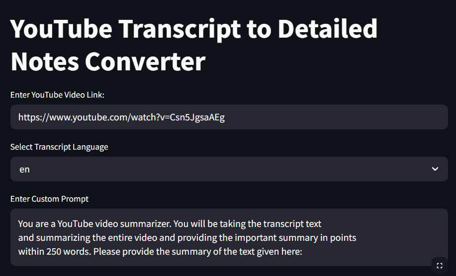
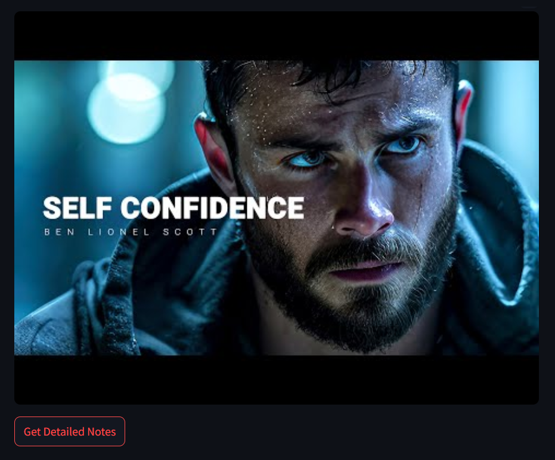
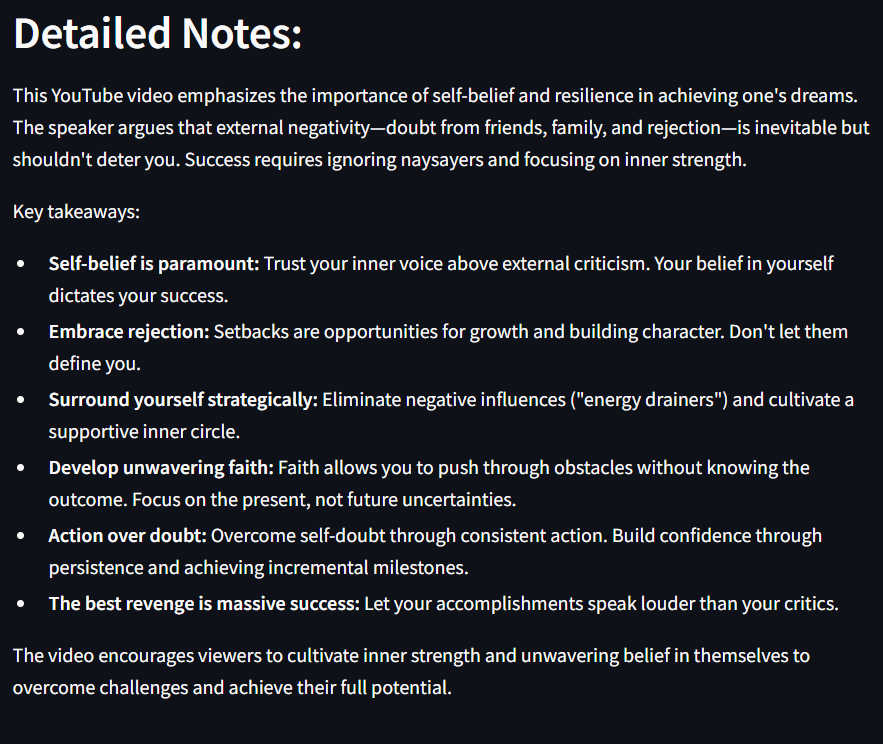

# 📽️ YouTube Transcript to Detailed Notes Converter
A simple and powerful Streamlit app that:

- Fetches the transcript from any YouTube video 🧠

- Summarizes it into detailed notes (in under 250 words) ✍️

- Powered by Google Gemini 1.5 Flash model ⚡


## 🚀 Features
- 📥 Input any YouTube video link

- 🌐 Choose transcript language (English, Hindi, or Auto-detect)

- ✏️ Option to customize the prompt for better control

- 🧠 Uses Gemini 1.5 Flash (fast & free model)

- 🎥 Shows the video thumbnail before generating notes

- 📝 Outputs clean, important notes in bullet points


## 📦 Installation
First, make sure you have Python installed.

Then, install the required libraries:

```
bash 

pip install streamlit google-generativeai youtube-transcript-api
```


## 🔑 Setup
1. Get your Google Gemini API Key from Google AI Studio.

2. Replace the GOOGLE_API_KEY in the code:

```
python

GOOGLE_API_KEY = "YOUR_ACTUAL_API_KEY"
```

## 🛠️ How to Run
Simply run the Streamlit app:
```
bash

streamlit run app.py
```
(Assuming you saved your code in app.py)

Then, it will open in your browser! 🌟


# 📋 Project Structure
| File Name    | Description                       |
|--------------|-----------------------------------|
| app.py       | Main Streamlit application        |
| README.md    | Project documentation file        |
| requirements.txt | List of required libraries    |


## 📸 Screenshots







- 🔗 Enter Video URL
- 🌐 Select Language
- ✏️ Customize Prompt (Optional)
- 🎯 Get Detailed, Summarized Notes Instantly!

## ⚡ Tech Stack
- Streamlit - UI framework

- Google Generative AI (Gemini) - Content generation

- YouTube Transcript API - Fetch video subtitles easily

## 🧠 Future Enhancements (Ideas!)
- Allow selection between Gemini 1.5 Flash and Gemini 1.5 Turbo

- Download notes as PDF or Markdown 📄

- Multi-language summarization 🌍

- Auto-detect YouTube Shorts links

## ✨ Credits
Built with ❤️ by AYUSH NAGAR.

## 📄 License
This project is open-source. Feel free to modify and share!

# 🚀 Happy Summarizing!


